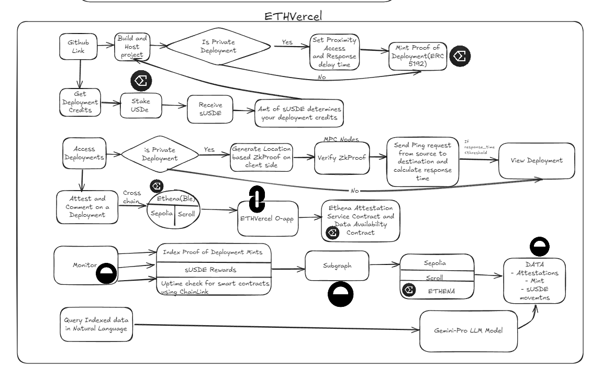

# ETHVercel

## Overview
ETHVercel is a revolutionary decentralized deployment platform that combines privacy-preserving deployment mechanisms with tokenized deployment credentials and cross-chain attestations. By leveraging zero-knowledge proofs for access control and implementing a novel staking mechanism through sUSDE, ETHVercel creates a secure, incentivized ecosystem for decentralized application deployment.

### System Architecture 

### 🌟 Key Features
#### Privacy-Preserved Deployments

- ZK-powered geolocation verification
- Response-time threshold validation
- Dynamic access control mechanisms
- Anti-VPN protection through multi-factor verification

#### Tokenized Deployment System

- Soul-bound Proof of Deployment tokens
- Deployment credentials through sUSDE staking
- Yield-generating deployment rights (15% APY)
- Non-transferable deployment attestations

#### Cross-Chain Attestation Network

- Omni-chain deployment verification
- LayerZero-powered attestation propagation
- Cross-chain deployment commenting system
- Unified attestation storage on Ethena Network

#### Monitoring & Analytics

- Real-time deployment analytics
- Chainlink Automation integration
- Natural language deployment queries
- Comprehensive deployment insights

### 🔗 Sponsor Integration Tracks
#### Ethena Network Integration

- Primary Network: Deployment and attestation infrastructure
- Token Integration: USDe and sUSDE for deployment credentials
- Staking Mechanism: 15% APY yield generation
- Impact: Created first-of-its-kind tokenized deployment rights system
- ETHENA ATTESTATION SERVICE using O-app for attestation

#### LayerZero Implementation

- O-App Integration: Cross-chain attestation protocol
- Omni Messaging: Universal deployment verification
- Impact: Enabled seamless cross-chain deployment attestations

#### Goldsky Integration

- Subgraph Development: Comprehensive deployment indexing
- LLM Integration: Natural language deployment queries
- Impact: Enhanced deployment discovery and analysis

### 🛠 Tech Stack
#### Smart Contracts

- Solidity ^0.8.22
- OpenZeppelin Contracts
- LayerZero O-App Framework
- Chainlink Automation Interface

#### Frontend

- React + TypeScript
- Tailwind CSS
- Framer Motion
- Ethers.js
- Shadcn

#### Backend & Infrastructure

- FastAPI
- IPFS/Web3.Storage
- Goldsky Indexing
- Gemini Pro LLM

### 🔮 Future Scope
#### Technical Enhancements

- Multi-chain deployment synchronization
- Advanced ZK-circuit implementation
- Enhanced privacy preserving features
- Automated deployment optimization

#### Ecosystem Growth

- DAO governance implementation
- Enhanced staking mechanisms
- Cross-chain deployment bridges
- Advanced attestation protocols

#### Platform Features

- Automated security auditing
- Enhanced analytics dashboard
- Advanced access control mechanisms
- Expanded cross-chain support
